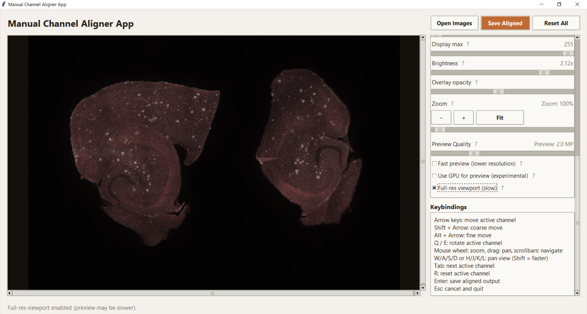
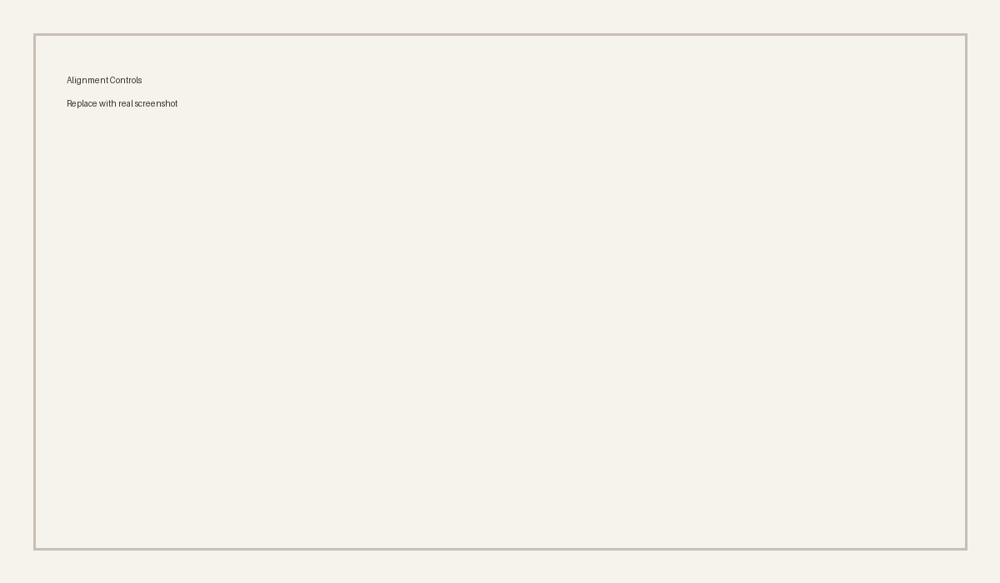

# Manual Channel Aligner App

This folder now contains the standalone Python app that replaces the old Fiji/ImageJ plugin.

## Features
- Manual alignment of 2+ channels with keyboard controls
- Per-channel transforms (translate + rotate)
- Live overlay preview with adjustable opacity
- Manual display min/max for visualization only
- Zoom controls with mouse wheel and click-drag pan
- Scrollbars for navigating large zoomed images
- Keyboard pan with W/A/S/D (or H/J/K/L)
- Brightness slider for preview only
- Preview quality slider + fast preview mode for speed
- Full-resolution viewport render (only visible region, for pixel-level alignment)
- Optional GPU preview (requires numpy + opencv-python)
- ? tooltips for every control
- Progressive render while panning/zooming (blurry -> sharp)
- Auto downscaled preview for large images (export remains full resolution)
- Drag & drop image loading (when `tkinterdnd2` is installed)
- Export aligned channels to a multi-page TIFF with a `Manual Aligned` tag
- Never overwrites original images

## Screenshots


*Screenshots are placeholders until real captures are added.*

## Usage
```bash
python3 -m manual_channel_aligner
```

You can also pass input paths (multiple files or one multi-page TIFF):
```bash
python3 -m manual_channel_aligner path/to/channel1.tif path/to/channel2.tif
```

### Windows (cmd.exe)
```bat
cd /d "<PROJECTS_DIR>\chanel alignment plugin-imagej"
.\.venv\Scripts\python -m manual_channel_aligner
```

## Keybindings
- Arrow keys: move active channel
- Shift + Arrow: coarse move
- Alt + Arrow: fine move
- Q / E: rotate active channel
- Tab: cycle active channel
- R: reset active channel
- Enter: save aligned output
- Esc: cancel and quit

## Notes
- All channels must have the same dimensions.
- Multi-page TIFFs are treated as channel stacks.
- RGB images are split into channels for alignment and saved as a TIFF stack.
- Metadata is preserved for TIFF inputs (image description is tagged with `Manual Aligned`).
- Preview uses auto-contrast for visibility only; exported data retains original intensities.
 - For pixel-level alignment, enable **Full-res viewport** to render only the visible region at full resolution.

## Install dependencies
```bash
python3 -m pip install -r requirements.txt
```

Drag & drop needs `tkinterdnd2`. If drag & drop shows a no-entry cursor, launch the app with the project venv:
```bash
cd "<WORKSPACE_DIR>/chanel alignment plugin-imagej"
.venv/bin/python -m manual_channel_aligner
```
